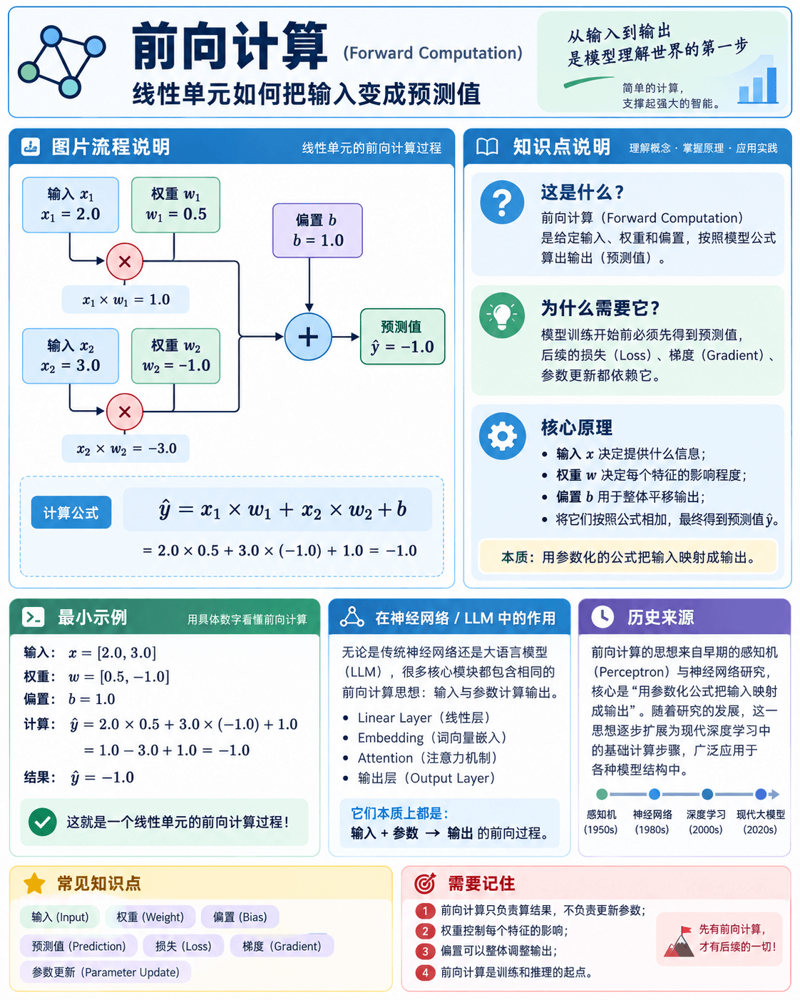

# Feature 01 - Forward Computation



这张说明卡片展示了一个线性单元如何把输入 `x`、权重 `w` 和偏置 `b` 组合成预测值 `y_hat`，并标注了每个组成部分的作用。

## 1. 这是什么

前向计算是：给定输入、参数和偏置，按照模型公式计算输出。

## 2. 为什么需要它

训练开始前，模型必须先根据当前参数得到预测结果。后续的 Loss、Gradient 和参数更新都建立在这个结果之上。

## 3. 核心原理

本 Feature 使用一个最简单的线性单元：

```text
y_hat = x1 * w1 + x2 * w2 + b
```

其中 `x` 是输入，`w` 是权重，`b` 是偏置，`y_hat` 是预测值。

## 4. 运行方式

在当前 Feature 目录执行：

```bash
uv run python main.py
```

当前 Feature 只使用 Python 标准库，不需要额外安装依赖。

## 5. 最小示例

示例使用：

```text
x = [2.0, 3.0]
w = [0.5, -1.0]
b = 1.0
```

预期预测值为 `-1.0`。

## 6. 输入与输出

- 输入：两个特征、两个权重和一个偏置
- 输出：一个浮点数预测值

## 7. 在 LLM 中的作用

神经网络中的 Linear Layer、Embedding、Attention 和输出层，本质上都包含类似的参数与输入计算。

## 8. 我需要记住什么

1. 前向计算只使用当前输入和当前参数。
2. 权重决定每个输入特征的影响程度。
3. 偏置让模型可以整体平移输出。
4. 前向计算本身还不会改变参数。

## 9. 练习

1. 修改 `x`，观察预测值如何变化。
2. 修改一个权重，判断它对结果的影响。
3. 说明为什么修改 `b` 会让输出整体增加或减少。
