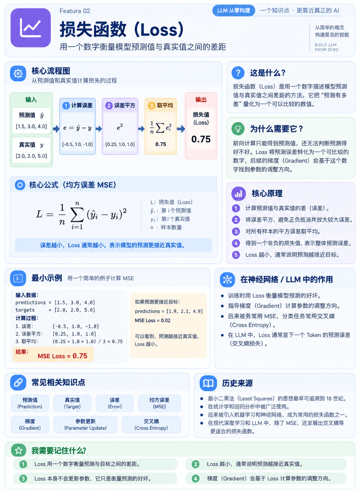

# Feature 02 - Loss



## 1. 这是什么

Loss（损失）是用一个数字描述模型预测值与真实值之间差距的方法。

## 2. 为什么需要它

前向计算只能得到预测值，还无法判断预测得好不好。Loss 把“预测有多差”变成一个可以比较的数字，后续 Gradient 会利用这个数字寻找参数调整方向。

## 3. 核心原理

本 Feature 使用最简单的均方误差（Mean Squared Error，MSE）：

```text
L = 1 / n * Σ(y_hat_i - y_i)^2
```

计算过程：

```text
预测值与真实值相减
→ 误差平方
→ 对所有样本取平均
→ 得到 Loss
```

误差越小，Loss 通常越小，表示预测更接近目标。

## 4. 运行方式

在当前 Feature 目录执行：

```bash
uv run python main.py
```

当前 Feature 只使用 Python 标准库，不需要额外安装依赖。

## 5. 最小示例

示例使用：

```text
predictions = [1.5, 3.0, 4.0]
targets = [2.0, 2.0, 5.0]
```

对应的误差为 `[-0.5, 1.0, -1.0]`，误差平方为 `[0.25, 1.0, 1.0]`，所以：

```text
MSE = (0.25 + 1.0 + 1.0) / 3 = 0.75
```

代码还会比较一组更接近目标的预测，观察它的 Loss 是否更低。

## 6. 输入与输出

- 输入：一组预测值和对应的一组真实值
- 输出：一个表示整体预测误差的浮点数

## 7. 在 LLM 中的作用

LLM 训练时也需要用 Loss 衡量模型预测下一个 Token 的好坏，只是语言模型通常使用 Cross Entropy，而不是这里的 MSE。

## 8. 我需要记住什么

1. Loss 用一个数字衡量预测与目标之间的差距。
2. Loss 越小，通常说明预测越接近目标。
3. Loss 负责告诉我们“现在预测得有多差”，但它本身不会更新参数。
4. Gradient 会进一步利用 Loss 计算参数应该如何调整。

## 9. 练习

1. 把一个预测值改得更接近目标，观察 Loss 的变化。
2. 把一个预测值改得更远，观察平方误差如何放大差距。
3. 思考：为什么不能只看所有误差的平均值，而要先平方？
