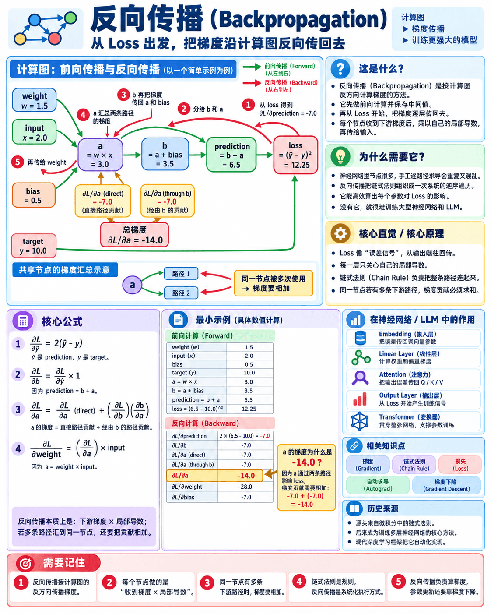

# Feature 05 - Backpropagation

## 1. 本章目标

理解如何在一个包含多个节点和分支的计算图中，从 Loss 开始逆序传播梯度，并在同一节点有多条下游路径时汇总梯度。

本章只研究手写反向传播，不实现通用自动求导系统，也不更新参数。

## 2. 这是什么

Backpropagation（反向传播）是按照计算图的反方向计算梯度的方法。它先完成一次前向计算并保存中间值，再从 Loss 的梯度开始，逐节点乘以局部导数。

本 Demo 使用下面的计算图：

~~~text
weight, input → a = weight × input
                    ├→ b = a + bias → prediction = b + a → loss
                    └─────────────────────────────────────→
~~~

节点 `a` 通过两条路径影响 `prediction`，所以反向传播到 `a` 时必须把两条路径的梯度相加。

## 3. 为什么需要它

Chain Rule 说明了一条路径上的局部导数如何连乘。真实神经网络包含大量节点、分支和参数复用，只沿一条路径手工计算会重复工作。

Backpropagation 将 Chain Rule 组织成一次系统的逆序遍历：每个节点接收来自下游的梯度，再把梯度传给自己的输入；如果一个节点有多个下游使用者，就汇总所有贡献。

## 4. 核心原理

反向传播可以分成三步：

1. 前向计算每个节点的值，并保存反向计算需要的中间结果；
2. 从输出节点开始，使用 `∂L/∂prediction` 作为起点，沿计算图反向传播；
3. 对同一节点来自不同路径的梯度求和，再继续向前传递。

对于本 Demo：

~~~text
a = weight × input
b = a + bias
prediction = b + a
loss = (prediction - target)²
~~~

## 5. 数学表示

Loss 对预测值的梯度为：

$$
\frac{\partial L}{\partial \hat{y}}=2(\hat{y}-y)
$$

因为 `prediction = b + a`：

$$
\frac{\partial L}{\partial b}
=\frac{\partial L}{\partial \hat{y}}\times 1
$$

$$
\frac{\partial L}{\partial a}\bigg|_{\text{direct}}
=\frac{\partial L}{\partial \hat{y}}\times 1
$$

而 `b = a + bias` 又提供了第二条从 `a` 到 Loss 的路径：

$$
\frac{\partial L}{\partial a}
=\frac{\partial L}{\partial a}\bigg|_{\text{direct}}
+\frac{\partial L}{\partial b}\times\frac{\partial b}{\partial a}
$$

最后，`a = weight × input`：

$$
\frac{\partial L}{\partial weight}
=\frac{\partial L}{\partial a}\times input
$$

## 6. 手工计算

取：

- `weight = 1.5`
- `input = 2.0`
- `bias = 0.5`
- `target = 10.0`

前向计算：

1. `a = 1.5 × 2.0 = 3.0`
2. `b = 3.0 + 0.5 = 3.5`
3. `prediction = 3.5 + 3.0 = 6.5`
4. `loss = (6.5 - 10.0)² = 12.25`

反向计算：

1. `∂L/∂prediction = 2 × (6.5 - 10.0) = -7.0`
2. `∂L/∂b = -7.0`；直接路径对 `a` 的贡献为 `-7.0`
3. 经由 `b` 的路径对 `a` 的贡献为 `-7.0`
4. `∂L/∂a = -7.0 + (-7.0) = -14.0`
5. `∂L/∂weight = -14.0 × 2.0 = -28.0`
6. `∂L/∂bias = -7.0`

这里的 `-14.0` 是梯度汇总的关键：同一个 `a` 被两个下游路径使用，不能只保留其中一条贡献。

## 7. 输入与输出

输入：

- 一个 `weight`；
- 一个 `input`；
- 一个 `bias`；
- 一个 `target`。

输出：

- 前向计算的中间节点、`prediction` 和 `loss`；
- 从 Loss 逆序传播到 `a`、`weight` 和 `bias` 的梯度；
- 有限差分得到的 `weight`、`bias` 梯度近似值，用于检查反向传播结果。

## 8. 运行 Demo

在本目录执行：

~~~bash
uv run python main.py
~~~

预期输出：

~~~text
weight = 1.5
input = 2.0
bias = 0.5
a = 3.0
b = 3.5
prediction = 6.5
target = 10.0
loss = 12.25
d_loss_d_prediction = -7.00
d_loss_d_b = -7.00
d_loss_d_a_direct = -7.00
d_loss_d_a_through_b = -7.00
gradient_wrt_a = -14.00
gradient_wrt_weight = -28.00
gradient_wrt_bias = -7.00
finite_difference_weight_gradient = -28.000000
finite_difference_bias_gradient = -7.000000
~~~

Demo 会用 `assert` 检查手写梯度与有限差分结果是否一致。

## 9. 在 LLM 中的作用

LLM 前向计算会经过 Embedding、线性层、Attention 和输出层等大量节点。得到 Loss 后，反向传播把输出梯度传回每一层，并为每个参数计算梯度。

现代深度学习框架会自动构建和遍历计算图，但核心仍是本章展示的局部导数传播与梯度汇总。参数如何依据梯度改变，将在 Gradient Descent 中学习。

## 10. 常见误区

- Backpropagation 不是只计算一个局部导数，而是从输出开始对整张计算图做逆序计算；
- 一个节点有多条下游路径时，梯度要相加，不是覆盖之前的结果；
- 梯度汇总发生在同一个变量上，不能把不同变量的梯度随意相加；
- 反向传播只计算梯度，不等于参数更新；
- 本 Demo 是手写固定计算图，不是通用自动求导引擎。

## 11. 我需要记住什么

1. Backpropagation 按计算图的反方向传播梯度。
2. 每个节点把收到的梯度乘以自己的局部导数，再传给输入。
3. 一个节点被多条路径使用时，要汇总所有路径的梯度贡献。
4. Chain Rule 是局部计算规则，Backpropagation 是在整张图上组织和复用这条规则的方法。
5. 反向传播得到梯度后，还需要 Gradient Descent 才会更新参数。

## 12. 配套代码

- `main.py`：手写前向计算、反向传播、梯度汇总和有限差分检查。

## 13. 前置知识

- [Feature 03 - Gradient](../feature03-gradient/)
- [Feature 04 - Chain Rule](../feature04-chain-rule/)

## 14. 下一章

[Feature 06 - Gradient Descent](../feature06-gradient-descent/)

下一章将学习：如何使用梯度反方向的小步更新参数，让 Loss 逐步下降。

## 15. 知识点说明

- 核心概念：Backpropagation 在计算图上从 Loss 开始逆序传播局部梯度，并汇总共享节点的多条路径贡献。
- Demo 图：`a=weight×input`、`b=a+bias`、`prediction=b+a`、`loss=(prediction-target)²`。
- 关键公式：`∂L/∂a = ∂L/∂a|direct + (∂L/∂b)(∂b/∂a)`；`∂L/∂weight=(∂L/∂a)×input`。
- 实验关系：`weight=1.5`、`input=2.0`、`bias=0.5`、`target=10.0` 时，`gradient_wrt_a=-14.0`、`gradient_wrt_weight=-28.0`、`gradient_wrt_bias=-7.0`。
- 边界：本 Feature 不执行参数更新，不实现通用自动求导，也不讨论优化器和学习率。
